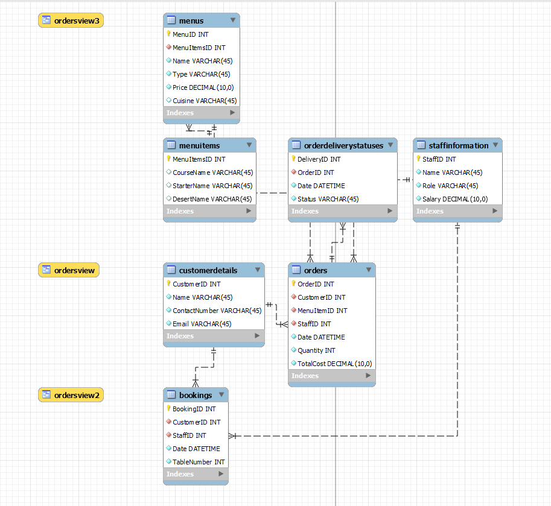
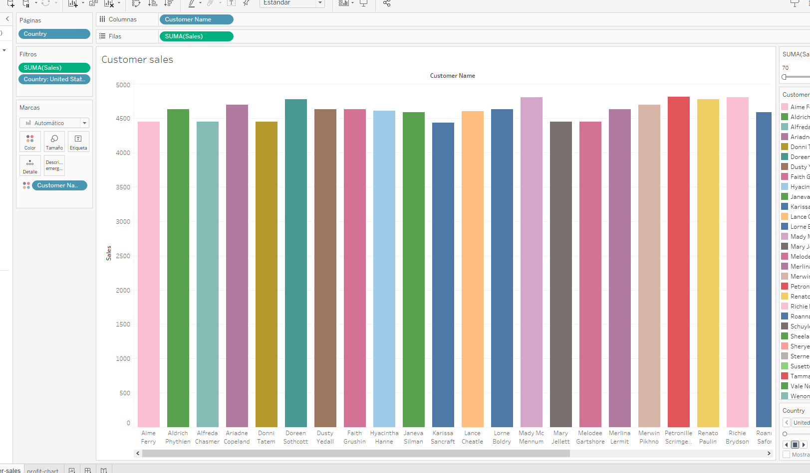
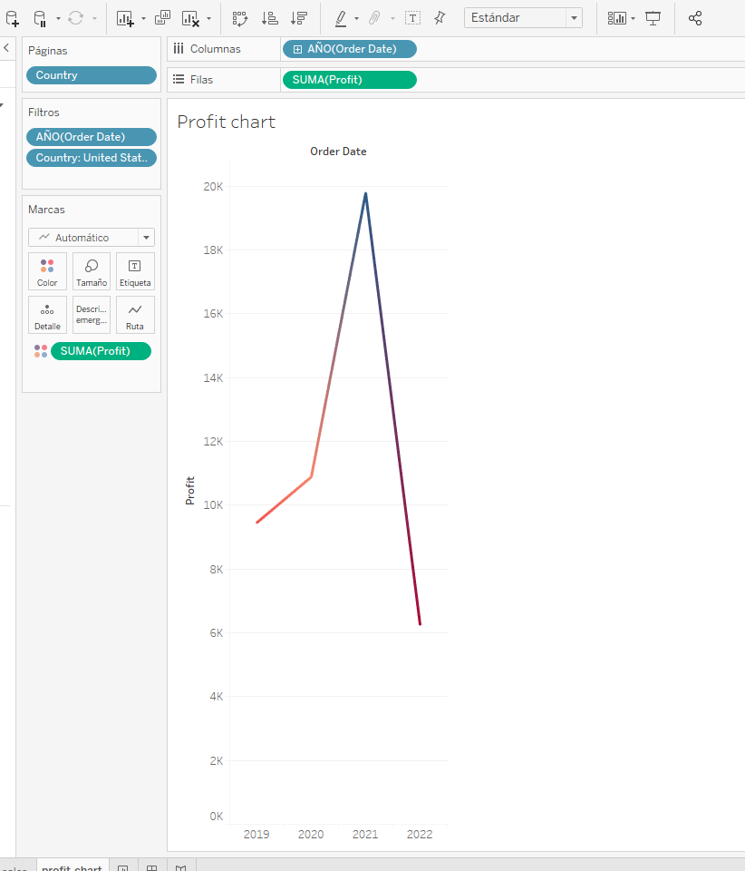
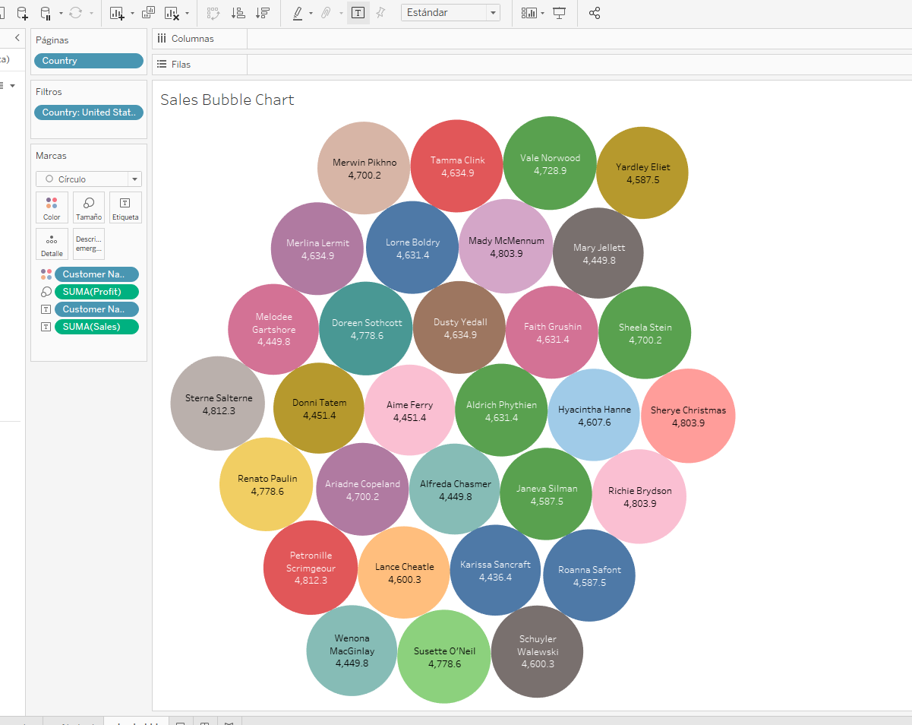
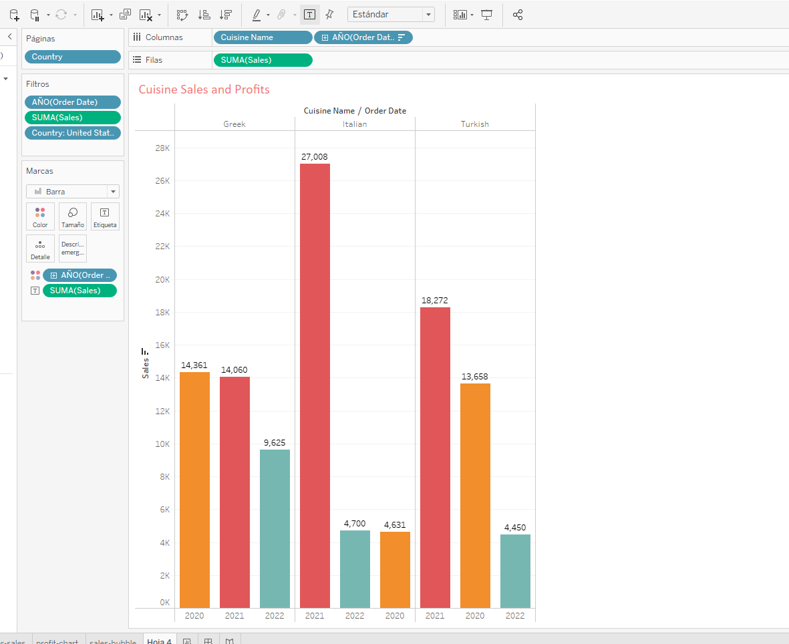
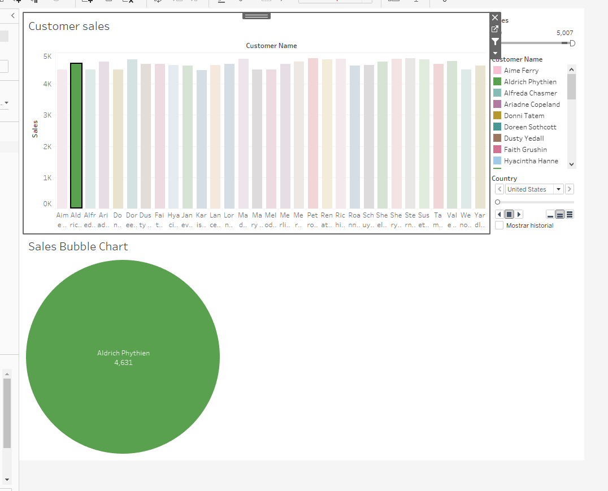

# Little Lemon Restaurant Management System


## Project Description

This project is structured to oversee the workflow of the Little Lemon quick-service eatery and constitutes a segment of the Meta Database Engineer Certificate program offered by Coursera. The scheme employs MySQL to construct the database architecture and Tableau for examining data. All the foundational files necessary to commence this undertaking are housed within the data directory.

## Entity-Relationship Diagram



## Installation and Setup

To set up the database, do the following:

1. **Install MySQL**: Download and install MySQL on your machine if needed.

2. **Download SQL File**: Obtain the [LittleLemonDB.sql](./LittleLemonDB.sql) file

3. **Import and Execute in MySQL Workbench**:
    - Open MySQL Workbench.
    - Navigate to `Server` > `Data Import`.
    - To import the `LittleLemonDB.sql` file, select the `Import` from the Self-Contained File` option and load the file.
    - To import and execute the SQL commands from the file, click on the `Start Import` button.

The tables and stored procedures should now be successfully added to your database..

## Stored Procedures

### GetMaxQuantity()
Our stored procedure is a valuable tool for inventory management, as it retrieves the maximum quantity of a specific item that has been ordered with confidence.

```sql
CREATE PROCEDURE GetMaxQuantity()
BEGIN
  DECLARE maxQty INT;

  SELECT MAX(Quantity) INTO maxQty FROM `LittleLemonDB`.`Orders`;

  SELECT maxQty AS 'Maximum Ordered Quantity';
END;
```

```sql
CALL GetMaxQuantity()
```

### CheckBooking()

Our CheckBooking stored procedure expertly validates table availability on any date. Receive a prompt status message informing you whether the table is available or already booked. Trust us for your booking needs!

```sql
CREATE PROCEDURE `LittleLemonDB`.`CheckBooking`(IN booking_date DATE, IN table_number INT)
BEGIN
    DECLARE table_status VARCHAR(50);

    SELECT COUNT(*) INTO @table_count
    FROM `LittleLemonDB`.`Bookings`
    WHERE `Date` = booking_date AND `TableNumber` = table_number;

    IF (@table_count > 0) THEN
        SET table_status = 'Table is already booked.';
    ELSE
        SET table_status = 'Table is available.';
    END IF;

    SELECT table_status AS 'Table Status';
END;
```

```sql
CALL CheckBooking('2022-11-12', 3);
```
### UpdateBooking()
Our efficient stored procedure effortlessly updates booking details in the database. With the booking ID and new date as parameters, rest assured that the system will reflect the changes accurately.

```sql
CREATE PROCEDURE `LittleLemonDB`.`UpdateBooking`(
    IN booking_id_to_update INT, 
    IN new_booking_date DATE)
BEGIN
    UPDATE `LittleLemonDB`.`Bookings`
    SET `Date` = new_booking_date
    WHERE `BookingID` = booking_id_to_update;

    SELECT CONCAT('Booking ', booking_id_to_update, ' updated') AS 'Confirmation';
END;
```
```sql
CALL `LittleLemonDB`.`UpdateBooking`(9, '2022-11-15');
```

### AddBooking() 
We're excited to offer a streamlined process for adding new bookings to our system. With multiple parameters available, such as booking ID, customer ID, booking date, and table number, you can easily complete the process.

```sql
CREATE PROCEDURE `LittleLemonDB`.`AddBooking`(
    IN new_booking_id INT, 
    IN new_customer_id INT, 
    IN new_booking_date DATE, 
    IN new_table_number INT, 
    IN new_staff_id INT)
BEGIN
    INSERT INTO `LittleLemonDB`.`Bookings`(
        `BookingID`, 
        `CustomerID`, 
        `Date`, 
        `TableNumber`, 
        `StaffID`)
    VALUES(
        new_booking_id, 
        new_customer_id, 
        new_booking_date, 
        new_table_number,
        new_staff_id
    );

    SELECT 'New booking added' AS 'Confirmation';
END;
```
```sql
CALL `LittleLemonDB`.`AddBooking`(17, 1, '2022-10-10', 5, 2);
```

### CancelBooking()
With the help of this stored procedure, someone can effortlessly manage  bookings by deleting the specific bookings you no longer need, freeing up resources and giving you more control over your data. Say goodbye to the hassle of manual deletion and enjoy a smoother booking management experience.
```sql
CREATE PROCEDURE `LittleLemonDB`.`CancelBooking`(IN booking_id_to_cancel INT)
BEGIN
    DELETE FROM `LittleLemonDB`.`Bookings`
    WHERE `BookingID` = booking_id_to_cancel;

    SELECT CONCAT('Booking ', booking_id_to_cancel, ' cancelled') AS 'Confirmation';
END;
```
```sql
CALL `LittleLemonDB`.`CancelBooking`(9);
```
### AddValidBooking()
This AddValidBooking stored procedure securely adds new table booking records. It initiates a transaction and meticulously checks table availability before inserting a new booking record. We're excited to offer this feature to our valued customers!

```sql
CREATE PROCEDURE `LittleLemonDB`.`AddValidBooking`(IN new_booking_date DATE, IN new_table_number INT, IN new_customer_id INT, IN new_staff_id INT)
BEGIN
    DECLARE table_status INT;
    START TRANSACTION;

    SELECT COUNT(*) INTO table_status
    FROM `LittleLemonDB`.`Bookings`
    WHERE `Date` = new_booking_date AND `TableNumber` = new_table_number;

    IF (table_status > 0) THEN
        ROLLBACK;
        SELECT 'Booking could not be completed. Table is already booked on the specified date.' AS 'Status';
    ELSE
        INSERT INTO `LittleLemonDB`.`Bookings`(`Date`, `TableNumber`, `CustomerID`, `StaffID`)
        VALUES(new_booking_date, new_table_number, new_customer_id, new_staff_id);

        COMMIT;
        SELECT 'Booking completed successfully.' AS 'Status';
    END IF;
END;
```
```sql
CALL AddValidBooking('2022-10-10', 5, 1, 1);
```


### CancelOrder()
The CancelOrder stored procedure removes a specific order by its Order ID. It executes a DELETE statement on the Orders table.

```sql
CREATE PROCEDURE CancelOrder(IN orderIDToDelete INT)
BEGIN
  DECLARE orderExistence INT;

  SELECT COUNT(*) INTO orderExistence FROM `LittleLemonDB`.`Orders` WHERE OrderID = orderIDToDelete;

  IF orderExistence > 0 THEN
    DELETE FROM `LittleLemonDB`.`OrderDeliveryStatuses` WHERE OrderID = orderIDToDelete;

    DELETE FROM `LittleLemonDB`.`Orders` WHERE OrderID = orderIDToDelete;

    SELECT CONCAT('Order ', orderIDToDelete, ' is cancelled') AS 'Confirmation';
  ELSE
    SELECT CONCAT('Order ', orderIDToDelete, ' does not exist') AS 'Confirmation';
  END IF;
END;
```
```sql
CALL CancelOrder(5);
```

## Data Analysis with Tableau
A Tableau workbook with charts and dashboards for easy data analysis was created. The workbook [here](./tab.twb)

### Customers sales


### Profit chart


### Sales Bubble Chart


###  Cuisine Sales and Profits


### Dashboard



