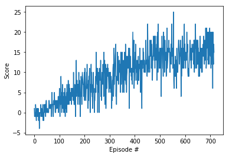

# Summary
In this report, the result from the navigation project is presdented usinfg a **DQN**.

# Learning Algorithm
Source code of learning algorithm is placed in `dqn/` directory.
The algorithm is composed mainly of next three parts.

## 1. DQN
As reinforcement learning algorithm, I implemented **DDQN**.
Because DQN seems to be working pretty well where I got reward till 15 with not that much episodes
Inside DQN,a three layer neural network has bee used as Q-Value Estimator.
Hidden layers are composed of ``State -> 64 -> ReLU -> 64 ->ReLU -> Action``

## 2. Experience Replay
Similarly to original DQN paper, **Experience Replay** has been implemented
In this technique, DQN model is trained by mini-batch from replay buffer.

## 3. Epsilon Greedy
Agent select next action based on Epsilon Greedy. At probability epsilon,
agent select at random from action space.
The value of epsilon is set 0.999, and decrease gradually with time until 0.001.

# Rewards Result
This is plot of rewards when training.
At Episode 616, agent performance met the criteria and stopped training.
(The mean score of last 100 episodes is more than +15)

# Ideas for Future Work
For further performance improvement, I wish to implement the DDQN algorithm. [Deep Reinforcement Learning with Double Q-learning](https://arxiv.org/abs/1509.06461)
- Performing Grid search can be an option for hyper-parameter tuning, especially Q-value model.

# Trained model
[Trained model (DDQN)](./checkpoint.pth)
