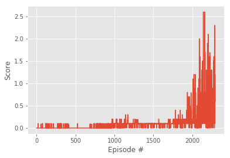

# Results report

## Selected hyperparameters
The following hyper parameters has been used for the experiment purpose:
|Name|Value|
|---|---:|
|Episodes|2293|
|LR_ACTOR|1e-4|
|LR_CRITIC|5e-3|
|Tau|7e-3 |
|Buffer size|1e5|
|Batch size|200|
|Target|30.0|
|UPDATE_EVERY_NB_EPISODE| 4|        
MULTIPLE_LEARN_PER_UPDATE| 3|   
|ACTOR_FC1_UNITS|400|       
|ACTOR_FC2_UNITS|300|        
|CRITIC_FCS1_UNITS| 400|      
|CRITIC_FC2_UNITS |300|       
|NON_LIN| F.relu|   
|WEIGHT_DECAY| 0|        
|GAMMA| 0.995|               
|TAU|1e-3|                                
|MU|0|                            
|THETA |0.15|                       
|SIGMA| 0.2|                        
|NOISE |1.0|                        
|NOISE_REDUCTION |1.0|      

## [DDPG](https://deepmind.com/research/publications/continuous-control-deep-reinforcement-learning/)
## [MADDPG](https://arxiv.org/abs/1706.02275)
     
I have not tried many variations. I started with default setup of DDPG and MADDPG in the paper.It seems to work well as it gained my expected score of 0.5 in 2293 episodes. 
Hence, I have not gone for different variations.
The network for actor and critic was 3 layer based. 2 fully connected layers with 400 and 300 units respectively for both actor and critic and the last layer with 1 units according to the observation space.
For activation function non linear was used for the hidden layers but Tanh and no linear were used for the output layer or actor and critic respectively. 
The structure of the network is: state -> fc layer 1 -> fc layer 2 ->BN -> output layer. In case of code implementation, I followed almost the same network from the exercises in the nano degree which is well explianed in the contents. 

## Result and Issues:
The plot or rewards for the given settings is given :

# Issues
- The network seems to be very slow at the starting though it started to pick up in the later part.
- Using batch normalizati0n did  help a lot to improve the training.

## Idea for future work:
- [Twin Delayed DDPG](https://spinningup.openai.com/en/latest/index.html) can be an improved version of our MADDPG as it will help to reduce the drammatic Q value estimation for the policy.
It also proposed one update per 2 A value estimation.
-  Prioritized experience replay can be another good idea as it will help to recall the experience from the past which are more significant than others. I think it will solve the slowness of learning. 
