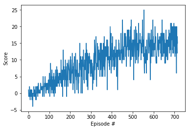

# Results report

## Selected hyperparameters
The following hyper parameters has been used for the experiment purpose:
|Name|Value|
|---|---:|
|Episodes|579|
|Epsilon start|1.0|
|Epsilon decay|0.995|
|Epsilon end|0.01|
|Learning rate|5e-4 |
|Gamma|0.99|
|Tau|1e-3 |
|Buffer size|1e5|
|Batch size|64|
|Update every|4|
|Target|15.0|

## [Deep Q Network](https://arxiv.org/abs/1312.5602)

I have not tried many variations. I started with Deep Q Network.It seems to work well as it gained my expected score of 15 in 579 episodes. Hence, I have not gone for different variations.
The network for actor was 3 layer based. 2 fully connected layers with 64 units and the last layer with 37 units according to the observation space. For activation function Relu was used. The structure of the network is: state -> fc layer 1 -> fc layer 2 -> output layer. In case of DQN, I followed almost the same network from the exercises in the nano degree which is well explianed in the contents. 

For the reply buffer purpose, prioritized reply buffer has been used.The plot or rewards for the given settings is givne below :

